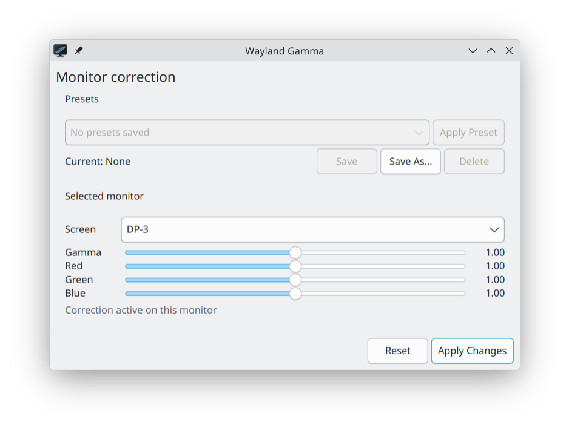

<!--
SPDX-FileCopyrightText: 2026 PhoenixEmik <phoenix0919mik@gmail.com>
SPDX-License-Identifier: CC-BY-SA-4.0
-->

<p align="center">
  
</p>

<h1 align="center">kgamma2</h1>

<p align="center">
  <a href="https://github.com/PhoenixEmik/kgamma2/releases/latest"></a>
  <a href="https://github.com/PhoenixEmik/kgamma2/actions/workflows/opensuse-rpm.yml"></a>
</p>

<p align="center">
  Per-monitor gamma and RGB adjustment for KDE Plasma Wayland using ICC VCGT profiles.
</p>

kgamma2 provides a graphical interface and command line tool backed by the
same controller. It uses KScreen and KWin's existing color management path,
tracks each monitor independently, and can restore the profile that was active
before an adjustment.

## Features

- Gamma range from 0.1 to 10.0 with a logarithmic GUI slider.
- Independent gamma, red, green, and blue settings for each monitor.
- Per-monitor generated ICC profiles and persistent output identifiers.
- Preservation of the original ICC profile and its non-VCGT calibration data.
- Reset support that restores the previous ICC path and profile source.
- Multi-monitor presets shared by the GUI and CLI.
- Stable monitor matching with EDID, serial, and connector fallbacks.
- Native Plasma application launcher and scalable application icon.

## Screenshot

<p align="center">
  
</p>

## Install on openSUSE Tumbleweed

Download the binary RPM from the
[latest release](https://github.com/PhoenixEmik/kgamma2/releases/latest), then
install it with Zypper so required libraries are resolved automatically:

```sh
sudo zypper install ./kgamma2-[0-9]*.x86_64.rpm
```

## Build from source

The build requires Qt 6, KDE Frameworks 6 I18n and Kirigami, libkscreen 6,
LittleCMS 2, CMake, and ECM.

```sh
cmake -S . -B build
cmake --build build
ctest --test-dir build --output-on-failure
```

Install the application, desktop file, and icon with:

```sh
cmake --install build
```

## CLI

Running `kgamma2` without arguments opens the GUI.

```sh
kgamma2 --version
kgamma2 --outputs
kgamma2 --status
kgamma2 --gamma 1.2
kgamma2 --red 1.0 --green 0.9 --blue 0.8
kgamma2 --output DP-1 --gamma 1.15
kgamma2 --reset --output DP-1
kgamma2 --reset
```

Adjustments without `--output` apply to all connected outputs. Unspecified
channel values retain the output's current kgamma2 values. `--outputs` also
prints persistent output IDs, which can be passed to `--output` when a
connector name is ambiguous.

## Presets

Presets capture all connected outputs as one named setup. They are stored in
`~/.config/kgamma2rc` through KF6 KConfig, separately from current output state
and generated ICC files.

```sh
kgamma2 preset save night
kgamma2 preset list
kgamma2 preset show night
kgamma2 preset apply night
kgamma2 preset current
kgamma2 preset delete night
```

The GUI provides Save, Save As, Delete, and Apply controls. Moving a slider
does not overwrite a saved preset. `preset current` reports `(modified)` after
a manual adjustment.

A preset records gamma and RGB values, whether each output is adjusted, stable
ID, EDID hash, model, serial, connector, and the original ICC path for
reference. Applying a preset matches the stable ID first, followed by EDID or
serial, then connector. Disconnected outputs are skipped and ambiguous matches
are rejected.

## ICC profile handling

Generated profiles and restore state are stored in the Qt application data
directory, normally `~/.local/share/kgamma2/`. When an existing ICC profile
contains a supported VCGT table or formula, kgamma2 composes its adjustment
with that calibration curve. Other ICC tags are copied byte for byte. An
unsupported VCGT format is rejected to avoid discarding calibration.

When an output uses KScreen's sRGB or EDID profile source, kgamma2 uses an sRGB
base while the adjustment is active and restores the previous source on Reset.
KScreen does not expose the effective EDID-derived ICC data for deriving a
profile from it.

## Releases and RPM packaging

The [openSUSE workflow](.github/workflows/opensuse-rpm.yml) builds and tests
the package on openSUSE Tumbleweed. A successful push to `main` increments the
patch version, creates a `vX.Y.Z` tag and GitHub Release, and attaches the
binary RPM, source RPM, debug RPMs, and SHA-256 checksums. Manual runs can
increment the patch, minor, or major version. Pull requests only produce a
temporary build artifact. Pushes that only change `README.md`, `docs/`, or
workflow files do not create a new version.

For local packaging, `packaging/opensuse/kgamma2.spec` builds the GUI and CLI
as one RPM. Create a source archive named for the version declared in the spec
and run `rpmbuild -ba` with that archive as `Source0`.

## Upstream and license

This fork follows [David Edmundson's KDE upstream](https://invent.kde.org/davidedmundson/kgamma2).
Add it to an existing clone with:

```sh
git remote add upstream https://invent.kde.org/davidedmundson/kgamma2.git
```

Licensing follows each file's SPDX header: application code and the icon use
`LGPL-2.1-or-later`, CMake and packaging files use `BSD-3-Clause`, and the
README and screenshot use `CC-BY-SA-4.0`. Complete license texts are available
in [`LICENSES/`](LICENSES/).
